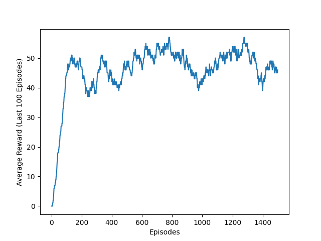

# Frozen Lake 8x8 Q-Learning Implementation

This repository contains a Python implementation of the Q-learning algorithm applied to the FrozenLake-v1 environment with an 8x8 grid. The goal of the agent is to navigate the frozen lake from a starting position to a goal position without falling into any holes.

## Code Description

The `frozen_lake.py` script implements the following:

- **Environment Setup:** Uses the `gymnasium` library to create the `FrozenLake-v1` environment with an 8x8 map and slippery ice.
- **Q-Learning Algorithm:** Implements the core Q-learning update rule:
  `Q(s, a) = Q(s, a) + alpha * (reward + gamma * max(Q(s', :)) - Q(s, a))`
- **Exploration-Exploitation Balance:** Employs an epsilon-greedy strategy for action selection, with epsilon decaying over episodes to shift from exploration to exploitation.
- **Training and Evaluation Modes:**
    - **Training Mode (`is_training=True`):** Initializes a Q-table, trains the agent over a specified number of episodes, and saves the learned Q-table to `frozen_lake.pk1`.
    - **Evaluation Mode (`is_training=False`):** Loads a pre-trained Q-table from `frozen_lake.pk1` and runs the agent without further learning.
- **Reward Tracking:** Records the reward received in each episode.
- **Performance Visualization:** Calculates and plots the average reward over the last 100 episodes, saving the plot as `frozen_lake8x8.png`.
- **Persistence:** Saves the learned Q-table using the `pickle` library.

## Performance

The following graph shows the average reward achieved by the Q-learning agent over the last 100 episodes during training. This demonstrates the agent's learning progress as it explores and exploits the environment.

## Usage

1.  **Install Dependencies:**
    \`\`\`bash
    pip install gymnasium numpy matplotlib pickle-mixin
    \`\`\`

2.  **Run the Script (Training):**
    To train the agent and save the learned Q-table, run:
    \`\`\`bash
    python frozen_lake.py
    \`\`\`
    This will train for 1500 episodes by default (as set in the `if __name__=='__main__':` block for training mode if you modify the `is_training` argument to `True`). A `frozen_lake.pk1` file containing the learned Q-table and `frozen_lake8x8.png` with the performance plot will be generated.

3.  **Run the Script (Evaluation):**
    To evaluate a pre-trained agent (make sure `frozen_lake.pk1` exists in the same directory), run:
    \`\`\`bash
    python frozen_lake.py
    \`\`\`
    This will load the saved Q-table and run the agent without further training. You can set `render=True` in the `if __name__=='__main__':` block to visualize the agent's actions in the environment.

## Visualizing Agent Behavior

If you run the script in evaluation mode with `render=True`, you will see a graphical representation of the Frozen Lake environment and the agent's path.

---
